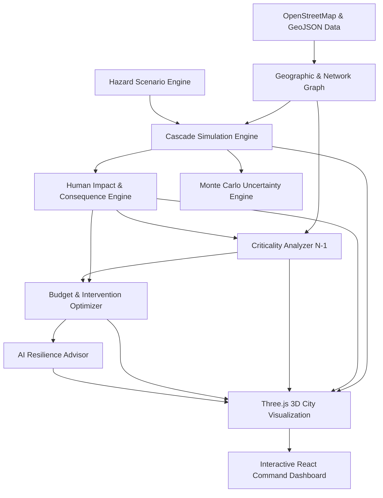

# RESILIO — Urban Infrastructure Resilience & Cascading Failure Simulator
### 3D Digital Twin, Multi-Sector Cascade Engine, and AI Decision Optimizer
**Geographic Scope**: Powai Lake & Hiranandani Gardens, Mumbai, Maharashtra, India (`19.1197° N, 72.9073° E`)

---

## 1. Overview

**RESILIO** is an interactive, data-driven urban infrastructure resilience simulator designed for smart governance and emergency response planning. Modern urban centers are hyper-connected socio-technical systems: a power outage at an electrical substation trips water treatment pumps, delays emergency ambulance dispatch, forces hospitals onto finite backup generators, and ripples through surrounding residential areas.

RESILIO models these multi-sector dependencies within a high-fidelity **3D digital twin** of the **Powai Lake and Hiranandani** region in Mumbai. The simulator allows city officials, urban planners, and engineers to:

1. **Explore Interconnected Infrastructure**: Inspect power grids, water pumping stations, hospitals, schools, and arterial road networks in an interactive 3D environment.
2. **Simulate Disruptions & Cascades**: Trigger single or multi-point failures and watch disruptions propagate across dependency edges over time.
3. **Quantify Human Consequences**: Measure affected populations, emergency response delays, and critical service outages via a normalized **Cascade Impact Score**.
4. **Analyze Uncertainty**: Run Monte Carlo simulations to calculate probabilistic failure distributions and 5th–95th percentile confidence ranges.
5. **Identify Critical Bottlenecks**: Systematically rank node and edge criticality to uncover hidden single points of failure.
6. **Optimize Budget Interventions**: Allocate a limited municipal capital budget to harden assets, compare alternative scenarios, and receive explainable advice from an **AI Resilience Advisor**.

---

## 2. Key Capabilities & Features

### 🌐 3D Interactive Urban Digital Twin (Three.js + React)
* **Real-World Geographic Grounding**: Built from OpenStreetMap data centered around Powai Lake and Hiranandani Gardens.
* **Procedural Typologies**: Renders detailed 3D building typologies (residential high-rises, commercial hubs, hospitals, educational campuses), road networks, vegetation, and animated water surfaces for Powai Lake.
* **Layer Toggles & Visualization**: Filter layers for Power, Water, Healthcare, Education, Transportation, and Hazard overlays.
* **Visual Cascade Pulses**: Real-time shader effects, particle pulses, and dynamic color states representing asset status transitions.
* **Interactive Map Controls**: Orbital camera navigation, top-down tactical orthographic view, view presets, and asset raycasting with detailed telemetry inspection.

### ⚡ Dynamic Time-Series Cascade Engine
* **6 Canonical Operational States**:
  $$\text{OPERATIONAL} \longrightarrow \text{DEGRADED} \longrightarrow \text{BACKUP} \longrightarrow \text{CRITICAL} \longrightarrow \text{FAILED} \longrightarrow \text{RECOVERING}$$
* **Multi-Sector Directed Dependencies**: Models supply-demand relationships across power lines (`power_dependency`), water mains (`water_dependency`), and transportation corridors (`road_connection`, `emergency_route`).
* **Resource Depletion**: Assets equipped with auxiliary power (e.g., Dr. L H Hiranandani Hospital) engage backup generators upon primary supply failure, dynamically counting down fuel reserves until exhaustion.
* **Capacity Overload & Tripping**: Dynamic load redistribution trips neighboring nodes when demand exceeds operational thresholds.
* **Repair & Restoration Cycles**: Emergency crews arrive after configurable delays, transitioning assets through recovery to full operational restoration.

### 🌧️ Hazard & Disaster Modeling
* **Monsoon Pluvial Flooding**: Simulates severe rainwater accumulation and waterlogging around low-lying Powai Lake perimeter roads.
* **Extreme Summer Heatwaves**: Simulates peak electrical grid strain, high ambient temperatures, and substation transformer overheating.
* **Critical Arterial Gridlock**: Models disruptions along JVLR (Jogeshwari-Vikhroli Link Road) and Central Avenue, obstructing emergency response access.

### 👥 Human Consequence & Uncertainty Analytics
* **Human Impact Metrics**: Translates technical infrastructure downtime into civilian impacts:
  * Population without power or potable water.
  * Disrupted healthcare and educational services.
  * Increased ambulance travel time (Emergency Response Delay).
* **Cascade Impact Score (CIS)**: A normalized $[0.0, 1.0]$ composite resilience metric weighting population affected, duration, vulnerability, and critical facility losses.
* **Monte Carlo Uncertainty Engine**: Evaluates 1,000+ stochastic iterations per scenario, producing probabilistic outcome distributions ($p_{05}$, median, mean, $p_{95}$).

### 🎯 Systematic Criticality Analysis ($N-1$ Removal)
* Systematically removes individual assets and transmission links to recalculate total cascade damage:
  $$\text{Criticality}(i) = \text{Impact}(\text{Network} \setminus \{i\})$$
* Flags single points of failure whose disruption causes disproportionate downstream collapse (e.g., Powai Central 220kV Substation).

### 💰 Budget Allocation & Knapsack Optimization
* Enables city administrators to set a fixed budget (e.g., ₹2,000,000).
* **Intervention Library**: Purchase modular resilience upgrades:
  * Auxiliary Diesel & Solar Backup Generators.
  * High-Capacity Stormwater Drainage Pumps.
  * Underground Power Line Encapsulation.
  * Substation Flood Defense Elevation.
  * Emergency Access Route Hardening.
* **Knapsack Optimizer**: Computes the optimal combination of interventions that minimizes residual impact within budget constraints.

### 🤖 Explainable AI Resilience Advisor
* Provides transparent, factual comparisons between the user's selected intervention plan and the mathematically optimal allocation.
* Highlights missed critical assets, evaluates Return on Investment (ROI), and explains why specific bottlenecks should be prioritized.

---

## 3. System Architecture



### Directory Structure

```
smart_gov_failure_sim/
├── data/                       # Canonical network, facilities, and population data
│   ├── network.json            # Complete topology: nodes, capacities, and dependency edges
│   ├── nodes.json              # Infrastructure asset specifications
│   ├── edges.json              # Directed dependencies and connections
│   ├── facilities.json         # Hospitals, clinics, schools, substations
│   └── population.json         # Demographic zones and populations served
├── web/                        # React 19 + Three.js Frontend Application
│   ├── src/
│   │   ├── three/              # Three.js 3D Renderers (Scene, Terrain, Buildings, Hazards)
│   │   ├── components/         # UI Panels (Dashboard, Timeline, HazardWizard, Advisor)
│   │   ├── simulation/         # Client-side cascade engine & state management
│   │   ├── impact/             # Human impact score & consequence calculation
│   │   ├── criticality/        # Systematic node and edge ranking
│   │   ├── optimization/       # Budget allocation & knapsack optimizer
│   │   ├── advisor/            # Natural language AI advice generator
│   │   └── hazards/            # Monsoon flood and heatwave scenario configurations
├── impact/                     # Python package: Consequence & Monte Carlo analytics
│   ├── impact_engine.py        # Cascade Impact Score calculator
│   ├── population/             # Population service loss modeling
│   ├── response/               # Emergency response travel time modeling
│   └── uncertainty/            # Monte Carlo parameter sampling & percentiles
├── track4/                     # Python package: Criticality, Optimization & Advisor
│   ├── criticality/            # Node and edge systematic removal algorithms
│   ├── optimization/           # Combinatorial budget optimizer
│   ├── interventions/          # Intervention catalog and effect semantics
│   └── advisor/                # Structured comparison AI advisor
├── scripts/                    # Ingestion & preprocessing utilities
│   ├── fetch_osm.py            # Overpass API extraction for Powai coordinates
│   └── osm_to_geojson.py       # Converts raw OSM elements to canonical GeoJSON
└── tests/                      # Automated contract & integration test suites
```

---

## 4. Getting Started

### Prerequisites
* **Node.js**: v18.0.0 or higher
* **npm**: v9.0.0 or higher
* **Python**: v3.10 or higher (for analytical backend modules)

### Installation

1. **Clone the repository**:
   ```bash
   git clone https://github.com/legalmonkey/smart_gov_failure_sim.git
   cd smart_gov_failure_sim
   ```

2. **Install web frontend dependencies**:
   ```bash
   npm install
   ```

3. **Install Python test dependencies (optional for backend tests)**:
   ```bash
   pip install pytest
   ```

---

## 5. Running the Application

### Development Mode
Launch the local development server with Hot Module Replacement (HMR):

```bash
npm run dev
```

Open your browser and navigate to `http://localhost:5173`.

### Production Build
Compile TypeScript and bundle optimized production assets:

```bash
npm run build
```

Preview the production build locally:

```bash
npm run preview --workspace=web
```

---

## 6. Running Automated Tests

The repository includes end-to-end contract validation and analytical unit tests:

### 1. Contract & Schema Validation (Node.js)
Verifies that all canonical mock fixtures conform to the frozen schemas:
```bash
node tests/validate-contracts.mjs
```

### 2. Analytical & Integration Tests (Python)
Executes tests for hazard specifications, cascade integration, and impact models:
```bash
python -m pytest tests/
```

### 3. Track 4 Optimization & Advisor Tests (Python)
```bash
python -m pytest track4/tests/
```

### 4. Track 3 Human Impact & Uncertainty Tests (Python)
```bash
python -m pytest impact/tests/
```

---

## 7. Flagship Demonstration Flow

To experience the full capabilities of RESILIO, follow this 8-step demonstration:

1. **Explore the Digital Twin**: Pan, rotate, and zoom around Powai Lake and Hiranandani Gardens. Inspect the 3D typography and active infrastructure assets.
2. **Inspect an Asset**: Click on **Dr. L H Hiranandani Hospital**. Observe its normal operating capacity, population served (25,000), incoming power dependency from **Powai Central Substation**, and 6-hour backup generator duration.
3. **Trigger a Disruption**: Open the **Hazard Wizard** or click the power substation and select **Trigger Failure**. Simultaneously disrupt an arterial segment of **JVLR**.
4. **Play the Simulation**: Press **Play** on the floating simulation dock.
   * Watch the power transmission line sever.
   * Notice the hospital switch to **BACKUP** mode with amber warning indicators.
   * Observe water treatment pumps entering a **DEGRADED** state.
5. **Watch the Cascade Propagate**:
   * Advance time past 6.0 hours: generator reserves deplete, and the hospital enters **FAILED** status.
   * Neighboring clinics and residential sectors face severe healthcare and water deficits.
6. **Inspect Consequence Telemetry**:
   * Open the **Resilience Overview** to review the composite **Cascade Impact Score**, total population affected, and ambulance delay metrics.
   * Inspect the **Uncertainty Card** to review the 90% confidence intervals derived from Monte Carlo iterations.
7. **Allocate Interventions**:
   * Open the **Build Menu** with a ₹2,000,000 budget.
   * Purchase a *Hospital Backup Generator Upgrade (+8h)* and *Stormwater Drainage Pumps*.
   * Rerun the scenario and note the drastic reduction in the impact score.
8. **Consult the AI Resilience Advisor**:
   * Open the **AI Advisor** modal to view a side-by-side comparison between your plan and the optimal allocation.
   * Review natural-language explanations of remaining vulnerabilities.

---

## 8. Data Attribution & Specifications

* **Geographic Coordinates**: $19.1197^\circ\text{ N}, 72.9073^\circ\text{ E}$ (Powai Lake & Hiranandani Gardens, Mumbai).
* **Map Data**: © [OpenStreetMap](https://www.openstreetmap.org/copyright) contributors (ODbL).
* **Coordinate System**: WGS84 / EPSG:4326 projected to local Cartesian coordinates ($x, z$ ground plane, $y$ elevation).
* **Units**:
  * Time: Hours ($h$, discrete steps of $0.1h$).
  * Distance: Meters ($m$) / Kilometers ($km$).
  * Currency: Indian Rupee (₹, INR).
  * Population: Number of individuals served.

---

## 9. License

This project is licensed under the MIT License. See the [LICENSE](LICENSE) file for details.
